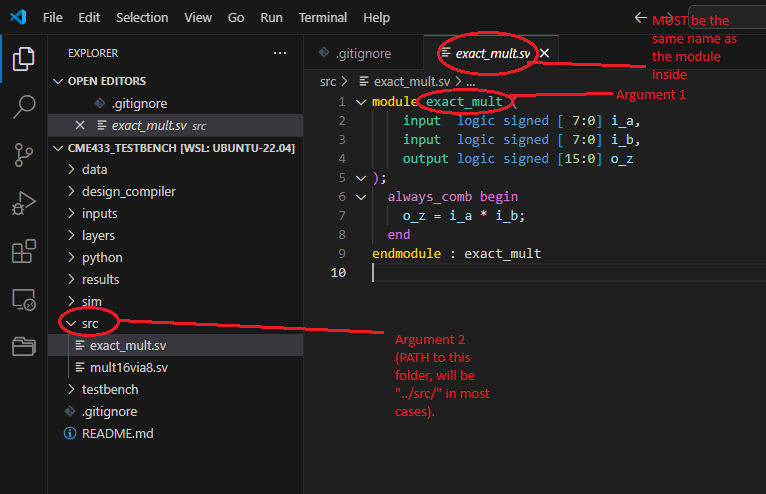

# Literature Review TB for CME 433 and EE 800
This git contains the testbench files for the LR exercise. Please direct any queries to Sayed @ ckp908@usask.ca  

# Synopsys Design Compiler (DC)

Run the following command to change dir to the dc_compiler folder from the home folder.  
```bash
cd design_compiler
```

Run the following commmand once inside the `design_compiler` folder to execute the dc_script.  
```bash
source run_dc_analysis.csh exact_mult ../src/
```

This will run the dc analysis for the sample exact multiplier provided in this repo. To use the same command for your custom design, use the following annotated image to provide arguments to the script:  



# Instructions
> [!IMPORTANT]
> Make sure that your terminal is using csh through running the following command ONCE in your terminal before you start any work: `csh` (You'll have to repeat this step for every new terminal window you open.)
# A: Testing your setup
1. Download/Clone the repository over your local machine. 
2. Make sure that ModelSim/QuestaSim software is installed on your machine and available in the PATH variable. 
    * If you don't have ModelSim/QuestaSim available on your personal machine, I would advise you to use machines avaialble in USASK ENGR Labs. 
3. Start a terminal and change directory into "sim" folder.
4. Use the following command to run the testbench with exact multiplier: `source ./gen_exact_results.sh`
5. Once the testbench is completed. Move to the python folder and make sure that numpy is installed in your python environment.
6. Run the following command to generate accuracy stats: `python get_mnist_stats.py exact`
7. Your output should be: `Acc: 0.96`

## B: Adding your multiplier
1. Copy the verilog/systemverilog source file of your multiplier in the "src" directory. 
2. Open "src/mult16via8.sv" file, and instantiate your multiplier at the directed place. 
3. If you've changed the source file. Remember that you must reverse it before you generate the exact results again.

## C: Running the testbench for ALL Layers
1. Open "testbench/tb_fullmnist.sv" file, and make sure that line#82 reads the following: `last_layer_mode = 0;` 
2. Start a terminal and change directory into "sim" folder.
3. Use the following command to run the testbench for your multiplier: `source ./run_tb.sh approx`
4. Once the testbench is completed. Move to the python folder and make sure that numpy is installed in your python environment.
5. Run the following command to generate accuracy stats: `python get_mnist_stats.py approx`
6. Your output should be: `Acc: [Accuracy of your multiplier here]`

## D: Running the testbench for the LAST Layer
1. Reverse any and all changes you've made to "src/mult16via8.sv". 
2. Repeat all the steps from Section A.
3. Repeat all the steps from Section B.
4. Open "testbench/tb_fullmnist.sv" file, and make sure that line#82 reads the following: `last_layer_mode = 1;` 
5. Start a terminal and change directory into "sim" folder.
6. Use the following command to run the testbench for your multiplier: `source ./run_tb.sh approx_lastlayer`
7. Once the testbench is completed. Move to the python folder and make sure that numpy is installed in your python environment.
8. Run the following command to generate accuracy stats: `python get_mnist_stats.py approx_lastlayer`
9. Your output should be: `Acc: [Accuracy of your multiplier here]`

## E: Calculating NMED
1. Modify the "python/get_mnist_stats.py" file with your own code to generate NMED for your multipliers. 

## F: Requirements for your final report and presentation:

> [!CAUTION]
> Perform all the steps included in Section A to E. 

1. Record the Accuracy values for Section C, and NMED for each layer for Section C. Here you will record a total of 4 metrics: 1 Accuracy, 3 NMED_per_layer
1. Record the Accuracy values for Section D, and NMED for the last layer. Here you will record a total of 2 metrics: 1 Accuracy, 1 NMED_last_layer
1. Write your own testbench to generate the NMED of your multiplier for all possible input values. Here you will record 1 metric: NMED_all_possible_inputs.

<!-- 
## G: EE800 Students
1. The floating point inputs and weights are provided in "data/EE800data" folder.
2. A sample model is given in "python/float_mnist_model.py".
3. You can run the sample model by moving to the python folder and make sure that numpy is installed in your python environment.
4. Run the following command to generate accuracy stats: `python float_mnist_model`
5. You should see the following output: `Accuracy: 0.962`
6. You will have modify the provided testbench for your multiplier and posit format. You can convert the provided .txt files (from Step#1) directly to posit and feed into the testbench.  -->

